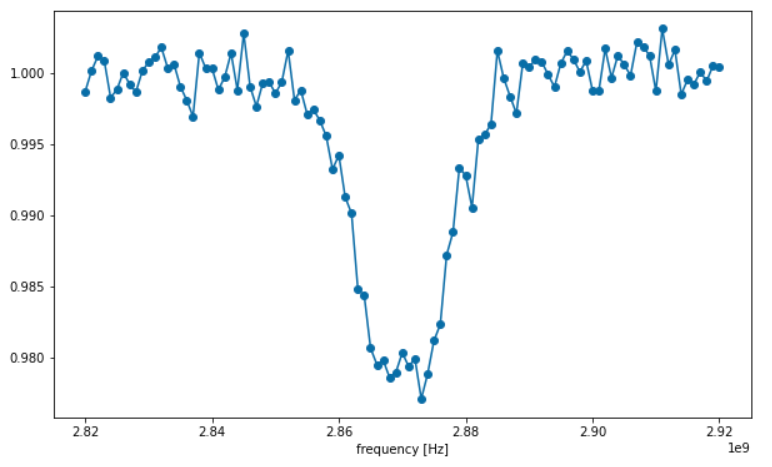
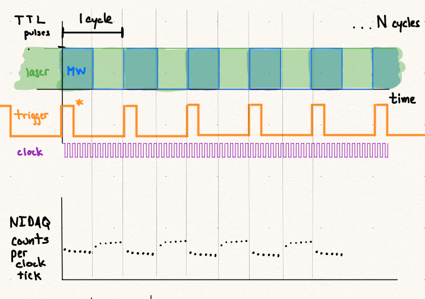
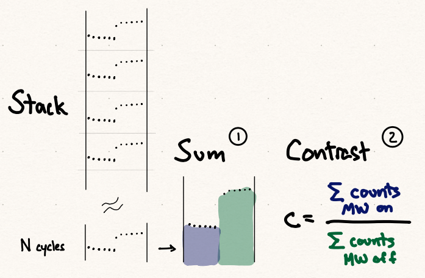
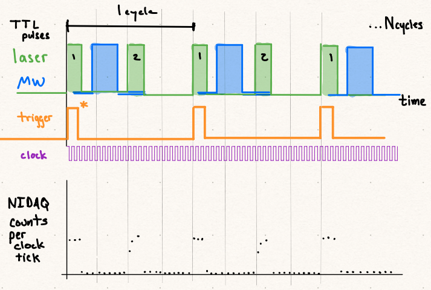
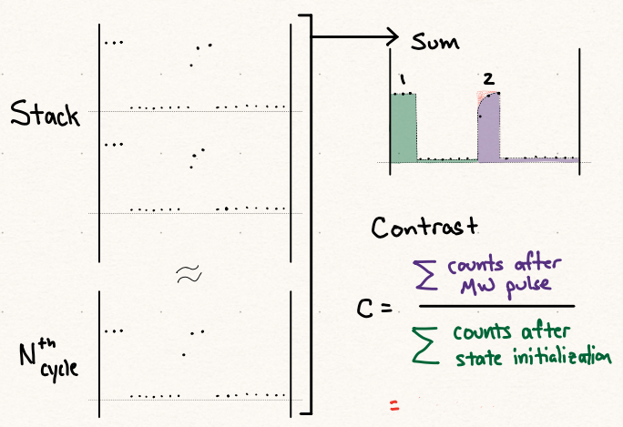
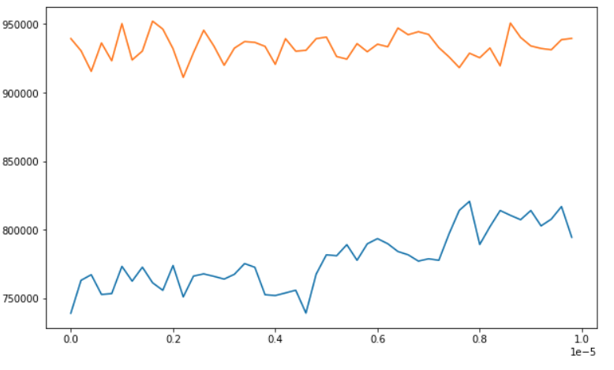
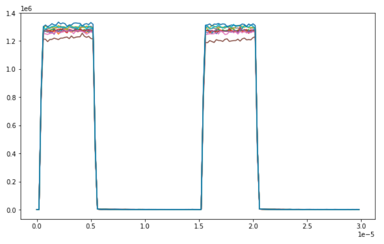

# QT3 Utils Experiment Classes

This document describes how the Experiment classes work in QT3Utils.

The Experiment classes are constructed in order to provide "canned" objects
that a researcher may use to conduct standard experiments. In addition, a
goal of these classes are to be extensible so that researchers
may add functionality, as this documentation will
demonstrate.

The Experiment classes are found in `qt3tuils.experiments` subpackage.
Each Experiment class should contain, at minimum, two functions:

* `run(N_cycles, post_process_function)`
* `experimental_conditions()`

The `run` function performs the experiment once the conditions for the 
experiment have been set. The `experimental_conditions` function
returns a Python dictionary object that contains the current conditions.
This dictionary could be used for inspection and saved with the 
generated data. 


# Setup

There are four working experiment classes as of this writing:

* CWODMR
* PulsedODMR
* Rabi
* Ramsey

The CWODMR, PulsedODMR and Rabi experiment classes have been tested and
demonstrated to work in the QT3 lab at this point. Demonstration of
Ramsey was paused, and contribution from another member of qt3 community
would be appreciated.

Extending (or copying) the Ramsey experiment to create Hahn Echo and
Dynamical Decoupling experiments should be straight forward.

Each Experiment object is instantiated with objects that control
the necessary hardware for the experiment and a set of default settings.

The following example demonstrates setup for CWODMR.

1. Import the necessary Python packages and modules

```
import qt3rfsynthcontrol
import qt3utils.nidaq
from qt3utils.pulsers.pulseblaster import PulseBlasterCWODMR
import qt3utils.experiments.cwodmr
```

2. Create RF synth object to control the Windfreak RFSynth Pro device

```
rfsynth = qt3rfsynthcontrol.QT3SynthHD('COM5')
```

2. Create NIDAQ EdgeCounter configuration object

```
nidaq_config = qt3utils.nidaq.EdgeCounter('Dev1')
```

3. Create a pulser object (in addtion to PulseBlaster, one may use the QCSapphire pulser)

```
cwodmr_pulser = PulseBlasterCWODMR(pb_board_number = 0,
                                         aom_channel = 0,
                                         rf_channel = 1,
                                         clock_channel = 2,
                                         trigger_channel = 3,
                                         rf_pulse_duration = 5e-6)
```

4. Create the experiment object, passing in the previously created hardware objects.

Also shown here are some of the optional parameters that one may set
-- and must set if the hardware configuration does not match the current default values.
(The default values in code match the hardware configuration currently in the QT3 lab.)

```
experiment = qt3utils.experiments.cwodmr.CWODMR(cwodmr_pulser, rfsynth, nidaq_config,
                                             photon_counter_nidaq_terminal = 'PFI0',
                                             clock_nidaq_terminal = 'PFI12',
                                             trigger_nidaq_terminal = 'PFI1',
                                             freq_low=2700e6,
                                             freq_high=3000e6,
                                             freq_step=2e6,
                                             rf_power=-10)
 ```

After creation of the experiment object, you may still change settings

```
experiment.freq_low = 2800e6
experiment.freq_high = 2950e6
experiment.freq_step = 1e6
# experiment.pulser.rf_power =
# experiment.pulser.rf_pulse_duration =
```

You can use the `experimental_conditions` function to capture the current
settings, which may be useful when you save your data to disk.

```
experiment.experimenta_conditions()
```

will return the following dictionary

```
{'freq_low': 2800000000.0,
 'freq_high': 2950000000.0,
 'freq_step': 1000000.0,
 'rf_power': -10,
 'pulser': {'rf_pulse_duration': 5e-06, 'clock_period': 2e-07}}
```

# Taking Data

The experiment object `run` function performs data acquisition.
The `N_cycles` parameter controls, essentially, how many data points
will be acquired for each value of your
independent experimental variable. In the case above of ODMR, the frequency of the
MW source is the independent experimental variable, ranging from 2.7 GHz to 3.0 GHz.
See the 'Details' section below to understanding how data are acquired, how to access the
raw data, and other information.

The `run` function iterates through the range of independent variable values.
For each value, 
  1. The hardware is set accordingly (changes the MW frequency, for example)
  2. Counts from the NIDAQ are acquired. 
  3. A post-processing step is performed. 

Each experiment has a default post-processing step converts raw counts 
to a desired quantity (often the contrast). 

The array returned should be a 2D array of shape (N, 2), where N is the
number of unique values of the experimental variable. The 0th column holds
the value of experimental variable, and the 1st column holds the data from
the post-processing function.

```
scan_data = experiment.run(N_cycles = 50000)
```

## Plotting Results

Here we show the results of a CWODMR scan.

```
import matplotlib.pyplot as plt

x_data = scan_data[:, 0]
y_data = scan_data[:, 1]

plt.figure(figsize=(10, 6))
plt.plot(x_data, y_data, 'o-', label='Data')
plt.xlabel('frequency [Hz]')
```




#### Messages to StdOut

During the `run` function, the python logging package is used to report the
status of data acquisition. By default, the logging level in the
Experiment classes is set to "INFO". This will send messages to stdout
at each value of the independent variable, reporting
the current value of the independent variable. These messages are useful,
especially during early development and usage of this class, to ensure
data are being acquired as expected. It's also easy to turn these messages
off once they are no longer desired by increasing the log level.

```
import logging
logging.basicConfig(level=logging.WARNING)
qt3utils.experiments.cwodmr.logger.setLevel(logging.WARNING)
```

## Details of Data Acquisition

This section describes the details of how the pulse sequences, hardware objects
and data acquisition work for the experiment classes.

### Experiment Timing

In these experiments the TTL pulser controls the timing of the various components.
TTL pulses

  * start and stop optical pumping / readout by applying
a voltage to the input of the RF amplifier for the AOM. 
  * control a switch through which microwave signals propagate to the antenna. 
  * provide a start acquisition trigger to the NIDAQ card
  * provide a clock signal to the NIDAQ.


### MW / RF Generator

The RF synthesizer object controls the Windfreak sythesizer and allows
an experimenter to set the power (in dBm) and frequency of the signal.

### Photon Counter

The NIDAQ counts TTL pulses from the SPCM to measure PL brightness. 
The NIDAQ Edge Counter configuration object creates the necessary
readout Tasks for the NIDAQ card. This object 
  * configures the input channel of the NIDAQ for counting signals from the SPCM
  * configures the clock signal for the Task
  * configures the trigger signal for the Task

Specification of **which** digital input channels are used for signal, clock and 
trigger a done during creation of the Experiment object. 


### Example

In CWODMR, a sample is continuously pumped with laser
light, while a MW signal is applied with a 50% duty cycle at some period.
The goal is to measure the contrast between the PL emission rate observed
while being driven with an external MW source to the rate observed when 
no MW source is present. 
When the MW field
frequency is on resonance (~2.87 GHz for NV- centers in diamond), the rate of
emitted PL should be measurably less while being driven.

To achieve this, the TTL pulser channel connected to the AOM's RF driver is held
at a constant high value, while the channel connected to the MW switch is
a square wave for a specified period with a 50% duty cycle.
In addition, the TTL pulser also issues a pulse (with small duty cycle) for
a trigger signal to the NIDAQ and a fast clock signal (50% duty cycle).
The period of the MW TTL signal, in this case, defines the length of one *cycle*.
A cycle, in this context, refers to the full pulse sequence needed to
perform one measurement of the experiment at one particular independent 
experimental value (state initialization, spin control, then readout).

The following sequence of actions occur when the `run` function is 
called with `N_cycles`. For each value of the MW frequency in the 
specified range of the experiment,

1. The TTL pulser is programmed to emit the desired pulse sequence.
2. The MW source is configued to emit at the desired frequency.
3. Given `N_cycles`, the total number of clock ticks for data acquisition is computed. This
will be `N_daq_samples = N_cycles * N_clock_ticks_per_cycle`
4. The NIDAQ Edge Counter is configured to count the number of TTL pulses (from the SPCM)
at each clock tick, for `N_daq_samples` clock ticks.



\*  the NIDAQ only cares about the first trigger it receives after it's 
Task has been started. All subsequent TTL trigger pulses are ignored.

Upon completion of the acquisition of `N_daq_samples`, a post-processing
function is called to analyze the data. This post-processing function is
responsible for converting the long sequence of measured counts to the
desired quantity. Each Experiment's `run` function has a default post-processing
function defined in the Experiment class's python module.

For CWODMR, the post-processing function performs the following actions.
First, the sequence of measured counts (of length `N_daq_samples`) is
reshaped (stacked) and then summed "vertically". Second, the contrast
is computed by integrating the fist and second half of the vertically summed
array and then dividing (Fig. [2](CWODMR_post_processing))




The figures above show example measured data for an *on-resonant* MW signal.
If the MW signal was off resonance, the NIDAQ count rate would be constant
(within statistical fluctuations) and zero contrast would be observed.

As another example, we show the TTL pulse sequence for pulsed ODMR
and the post-processing steps (again, for an on-resonant MW signal).




You can find other pulse sequences in the
[examples/pulse_blaster_testing.ipynb](../examples/pulse_blaster_testing.ipynb)
Jupyter notebook in this repository.

### The `run` loop

The above procedure occurs for every value in the set of experimental
independent values. For ODMR, the independent value is the MW frequency. For
Rabi oscillations, the independent value is the duration of the on-resonant
MW signal. For Ramsey, Hahn Echo and Dynamical Decoupling, the independent
value is the free-precession times.

Below is a pseudo-python code outline of the `run` loop.

```
output_data = []
for value in [independent values]:
  configure_hardware(value)
  N_daq_samples = N_cycles * N_clock_ticks_per_cycle
  data = read_data_from_nidaq(N_daq_samples)
  data = post_processing_function(data, experiment_object)
  output_data.append(data)

return output_data
```

where the `experiment_object`, an instance of the class, 
is passed to the post-processing function, which assists the post-processing
function in performing calculations by accessing
the Experiment attributes.

## Custom Post-Processing

A user can arbitrarily specify the post-processing function by passing
in a function as an arguemt to the `run` function.

For example, one can use the stack and sum function, which is already
[defined here](../src/qt3utils/experiments/common.py#L2) in `qt3utils`.

```
scan_data = experiment.run(N_cycles=50000,
                           post_process_function=qt3utils.experiments.common.aggregate_sum)
```

The `scan_data` array is still of shape (N, 2), where the value in the 0th
column is the independent variable (MW frequency in this case), but the data
in the 1st column is an array of the stacked and summed counts.

Shown below is a plot of the summed counts for two different
MW frequencies in a CWODMR experiment -- one on resonance (blue) and one
off resonance (orange).
Time is along the horizontal axis (10 microseconds) and count rate is along
the vertical. Notice that for the off resonance data, the count rate is
essentially constant. For the on resonance data, you can see the PL count rate
begin to increase starting at 5 microseconds, which corresponds to when
the MW signal is turned off by the switch.




The code to produce this plots looks like

```
def get_scan(scan_array, desired_frequency):
  """
  function that finds a scan with a MW frequency nearest to the desired_frequency
  """
  all_frequencies = scan_array[:,0]
  res_index = np.where(np.isclose(all_frequencies,desired_frequency))
  scan = scan_array[int(res_index[0])]
  return scan

def plot_summed_data_from_scan(scan, experiment_obj):
  """
  function that plots the average count rate from
  a stacked/summed array representing total counts, using the
  experiment_obj to convert to a count rate.
  """
  microwave_frequency = scan[0]
  summed_array = scan[1]
  N_samples = len(summed_array)

  t = np.linspace(0, N_samples * experiment_obj.pulser.clock_period,
                  num=N_samples)
  ave_count_rate = (summed_array / experiment_obj.N_cycles) / experiment_obj.pulser.clock_period

  plt.plot(t, ave_count_rate)


# plot on resonance data
scan = get_scan(scan_data, 2.870e9)
plot_summed_data_from_scan(scan, experiment)

# plot off resonance data
scan = get_scan(scan_data, 2.900e9)
plot_summed_data_from_scan(scan, experiment)

```


Similarly, for pulsed ODMR, where a number of scans are shown.



The code to produce these plots looks like

```
for scan in scan_data[::10]:
  plot_summed_data_from_scan(scan, experiment)
```

### Using your own function

It's easy to define and use your own post-processing function.

```
WARNING: I have not checked to be sure this is correct!!!

def cwodmr_contrast_with_error(raw_data, experiment_obj):
  # use the built-in function to convert the raw_data to the stacked/summed array
  summed_data = qt3utils.experiments.common.aggregate_sum(raw_data, experiment_obj)

  microwave_on = np.sum(summed_data[:len(summed_data)//2])
  microwave_off = np.sum(summed_data[len(summed_data)//2:])
  contrast = microwave_off / microwave_on

  microwave_on_std = np.sqrt(microwave_on)  # assume poisson statistics
  microwave_off_std = np.sqrt(microwave_off)

  std_dev = contrast * np.sqrt((microwave_on_std/microwave_on)**2 + (microwave_off_std/microwave_off)**2)
  return [contrast, std_dev]

scan_data = experiment.run(N_cycles=50000, post_process_function=cwodmr_contrast_with_error)

mw_frequencies = scan_data[:, 0]
computed_data = scan_data[:, 1]

computed_data = np.array(computed_data) # convert the python list to a numpy array
contrast = computed_data[:,0]
contrast_err = computed_data[:, 1]

plt.errorbar(mw_frequencies, contrast, contrast_err, fmt='o-')
plt.xlabel('frequency [Hz]')
```

## Extending Data Acquisition

In addition to computing a different value from the raw data, one could
perform any operation, including reaching out to different hardware.
The following demonstrates how one could take data from a spectrometer
at each step of a CWODMR scan.

```
spectrometer_results = []

# we need a pulser object that holds a channel high indefinitely
hold_mw_pulser = PulseBlasterArb(pb_board_number=0)
cycle_duration = 10e-3 # arbitrary time length
hold_mw_pulser.add_channels(experiment.pulser.rf_channel,
                            start_time=0,
                            pulse_width=cycle_duration)

def take_spectrum_after_contrast_and_error(raw_data, experiment_obj):

  # use our defined function above to compute contrast as before
  contrast, std_dev = cwodmr_contrast_with_error(raw_data, experiment_obj)

  # now take data from the spectrometer
  # first hold open the MW switch because we want to take a spectrum
  # when there is an applied MW field
  hold_mw_pulser.program_pulser_state()
  hold_mw_pulser.start()
  spectrometer_data = take_spectrum()  # assume this function exists somewhere
  spectrometer_results.append([experiment_obj.current_rf_freq, spectrometer_data])

  # return TTL pulser back to original state
  experiment_obj.pulser.program_pulser_state()
  experiment_obj.pulser.start()

  return [contrast, std_dev]

scan_data = experiment.run(N_cycles=50000,
                           post_process_function=take_spectrum_after_contrast_and_error)


mw_frequencies = scan_data[:, 0]
computed_data = scan_data[:, 1]  

# spectrometer_results is a list of results from the spectrometer

```

Note that in order to write this function, however, the author needs to know some
details about the internal workings of the CWODMR experiment object.
In particular, the author must have known that the CWODMR experiment object
contains attributes like `current_rf_freq` and `rfsynth_channel`. The author
also needs to know that the MW switch needs to be turned by using
a `PulseBlasterArb` object and then restoring the pulse sequences by
calling the experiment object's pulser.

The only way to know this information, at this point,
would be to read the source code since not all attributes of each class are well
documented yet. :(
